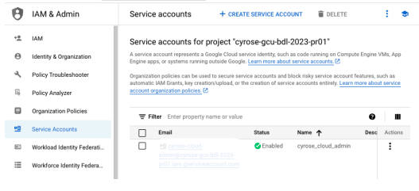
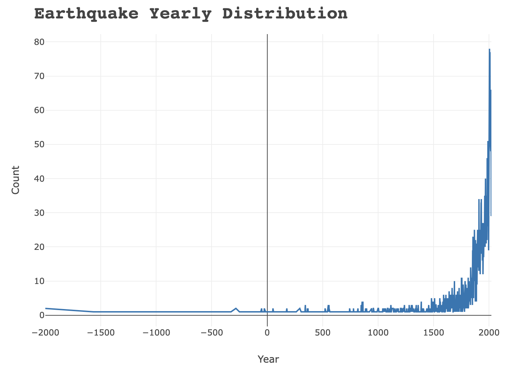

# Executing SQL Queries in Python

This section aims to provide a comprehensive guide and code examples for seamlessly integrating SQL queries into your Python applications.

## Overview
In the world of data-driven applications, the ability to interact with databases remotely is crucial. This repository focuses on demonstrating how to execute SQL queries using Python, leveraging popular libraries and frameworks. From connecting to databases, performing basic CRUD operations to handling advanced querying, we've got you covered.

## Key Features
- **Simple Integration**: Learn how to connect Python to BigQuery
- **Query Execution**: Explore techniques for executing SQL queries directly from your Python scripts, allowing for dynamic and data-driven applications.

## Getting Started
## `Acquire Google Cloud Credential`
### **Acquire a Google Cloud Platform (GCP) service account key**

The following [steps](https://cloud.google.com/iam/docs/keys-create-delete) will guide you  on how acquire the Google Service account Key:
1. On the left GCP menu accessed through the hamburger menu Go to `IAM & Admin > Service Accounts.` On the Service accounts page click `+CREATE SERVICE ACCOUNT`.



2. On the opening page input the `name` of the service account
then click `CREATE AND CONTINUE`. Select role dropdown menu select `Basic` then `owner`. This will give the Python Colab code all access to the GCP service. Proceed and click DONE.
3. Select a project.
4. Click the email address of the service account that you want to create a key for.
5. Click the `Keys` tab.
6. Click the Add key drop-down menu, then select Create new key.
7. Select `JSON` as the Key type and click `Create`.

Clicking `Create` downloads a service account key file. After you download the key file, you cannot download it again.

### **Create a bucket in the Google Cloud Storage**
1. Go to Cloud Storage > `Bucket`.
2. Initiate the creation of a new bucket by clicking `+CREATE`
3. Name the bucket storage then click `continue`. With other variables constant click `create`

The bucket is the storage for all the SQL query outputs.

## `Setup Environment`
To setup the python notebook to have access to BigQuery, we will use the `google-cloud-bigquery` library. To install it run the below commmand:

```python
pip install google-cloud-bigquery
```

### Google Authentication
Run the below to authenticate Python access to BigQuery filling `path to JSON service Key` and `storage bucket name`:
```python
# Import Google service account API Key for Authentication
path = 'path to Google Service Account API Key'
os.environ['GOOGLE_APPLICATION_CREDENTIALS'] = path

# For running queries
client = bigquery.Client()

# Accessing the bucket in the storage
storage_client = storage.Client()
bucket = storage_client.get_bucket('google_bucket_name') #replace with bucket name
```
The following steps sets up the notebook to have full access to BigQuery; all the data and can execute SQL queries.

## Code Syntax
For all the statistical queries the following is the syntax:
```python
table_name = client.query(
    '''
    SQL_QUERY
    ''').result().to_dataframe()

# Write dataframe to google storage:
bucket.blob('table_name.csv').upload_from_string(table_name.to_csv(), 'text/csv')

# View table
table_name
```
### `Example`
The following query outputs the dimensions of the table:
```python
eq_table_dimensions = client.query(
    '''
    SELECT
      total_entries,
      no_of_columns
    FROM
      (SELECT COUNT(*) AS total_entries
      FROM `youtube-factcheck.earthquake_analysis.earthquakes_copy`) AS entries,
      (SELECT COUNT(DISTINCT column_name) AS no_of_columns
      FROM `youtube-factcheck`.earthquake_analysis.INFORMATION_SCHEMA.COLUMNS
      WHERE table_name = "earthquakes_copy") AS columns;
    ''').result().to_dataframe()

# Write dataframe to google storage:
bucket.blob('eq_table_dimensions.csv').upload_from_string(eq_table_dimensions.to_csv(), 'text/csv')
eq_table_dimensions
```

Results:
| total_entries	| no_of_columns |
| -----------	| ------------- |
|	6272	    |    48         |

# Visualising Data in Python
This section leverages on  Python's visualization libraries to bring the BigQuery results to life. From geographic visualizations with [Folium](https://pypi.org/project/folium/), 3D mapping with [Kepler.gl](https://kepler.gl/) to interactive charts with [Plotly](https://plotly.com/), you'll find a diverse set of techniques to convey your data story.

### `Example`
#### Yearly Earthquake Distribution



#### Kepler Map
Here is the live [map](http://127.0.0.1:5500/Python/Map%20Visuals/eq_world_dist.kgl.html).


While Python🐍 allows such visualize, we cannot visualize dashboards, except for syncing D3js to create python apps. Hence the need for Tableau. See the [Tableau](https://github.com/gmusebe/BigData_Landscape/tree/main/Tableau) directory to vies the live dashboards.